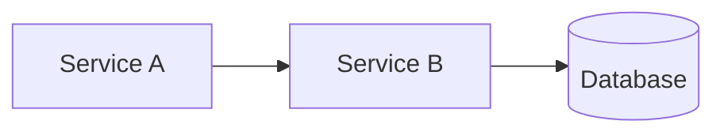

# Architecture Documentation Skill

Generates comprehensive, hierarchical architecture documentation from broad system overview to specific module details.

## Workflow

1. **Discovery** - Analyze project structure, detect stack, identify entry points
2. **Generate Documentation** - Create markdown files with embedded Mermaid diagrams (broad → specific)
3. **Convert Diagrams** - Run SVG conversion script to render diagrams as images
4. **Generate PDF** - Combine all markdown files into a single PDF document

## Output Structure

```
docs/architecture/
├── 00-system-overview.md      # Level 1: System context
├── 01-components.md           # Level 2: Container/component view
├── 02-data-flow.md           # Level 4: Data flow & patterns
├── modules/                   # Level 3: Per-module deep dives
│   └── <module-name>.md
└── architecture-documentation.pdf  # Combined PDF output
```

## Documentation Levels

### Level 1 - System Overview (`00-system-overview.md`)
- High-level purpose and goals
- External dependencies and integrations
- System context diagram (C4 Level 1)

### Level 2 - Components (`01-components.md`)
- Major components/modules
- Data stores, APIs, services
- Container diagram (C4 Level 2)
- Component interaction diagram

### Level 3 - Module Deep Dives (`modules/<module-name>.md`)
- Per-module documentation
- Key classes/functions
- Sequence diagrams for important flows
- Dependency graphs

### Level 4 - Data Flow (`02-data-flow.md`)
- Request/response flows
- Data transformation pipelines
- State management patterns

## Diagram Guidelines

Read `reference/diagram-types.md` for Mermaid templates appropriate for each level:
- **Level 1**: C4Context diagrams
- **Level 2**: C4Container, flowchart diagrams
- **Level 3**: Sequence diagrams, class diagrams
- **Level 4**: Flowchart, sequence diagrams

## Embedding Diagrams

Embed Mermaid diagrams directly in markdown:

~~~markdown
## Component Overview


~~~

## Converting to SVG

After generating documentation, run the conversion script:

```bash
./scripts/convert-mermaid-to-svg.sh docs/architecture
```

This converts all Mermaid code blocks to SVG images. Original markdown is preserved as `.template.md` files.

**Prerequisites:** Requires `@mermaid-js/mermaid-cli`. Install with:
```bash
npm install -g @mermaid-js/mermaid-cli
```

Or the script will use `npx` automatically.

## Generating PDF

After converting diagrams to SVG, generate a combined PDF:

```bash
./scripts/generate-pdf.sh docs/architecture
```

This combines all markdown files (in order: overview → components → data-flow → modules) into a single PDF with table of contents.

**Prerequisites:** Requires `pandoc` and `typst`. Install with:
```bash
brew install pandoc typst
```

The script automatically:
- Combines markdown files in the correct order
- Includes SVG diagrams as images
- Generates a professional PDF with headers and page numbers
- Creates a table of contents

## Step-by-Step Process

1. **Analyze the codebase:**
   - Read package.json/Cargo.toml/go.mod for dependencies
   - Identify main entry points
   - Map directory structure

2. **Create docs/architecture/ directory**

3. **Generate Level 1 first** (00-system-overview.md)
   - Describe what the system does
   - List external integrations
   - Add C4Context diagram

4. **Generate Level 2** (01-components.md)
   - Identify major components
   - Document their responsibilities
   - Add container/component diagrams

5. **Generate Level 3** (modules/*.md)
   - One file per significant module
   - Include sequence diagrams for key flows

6. **Generate Level 4** (02-data-flow.md)
   - Document data flows through the system
   - Add flowchart diagrams

7. **Run SVG conversion** (optional, user-triggered)
   - Execute `scripts/convert-mermaid-to-svg.sh`

8. **Generate PDF** (optional, user-triggered)
   - Execute `scripts/generate-pdf.sh docs/architecture`
   - Creates `architecture-documentation.pdf`
