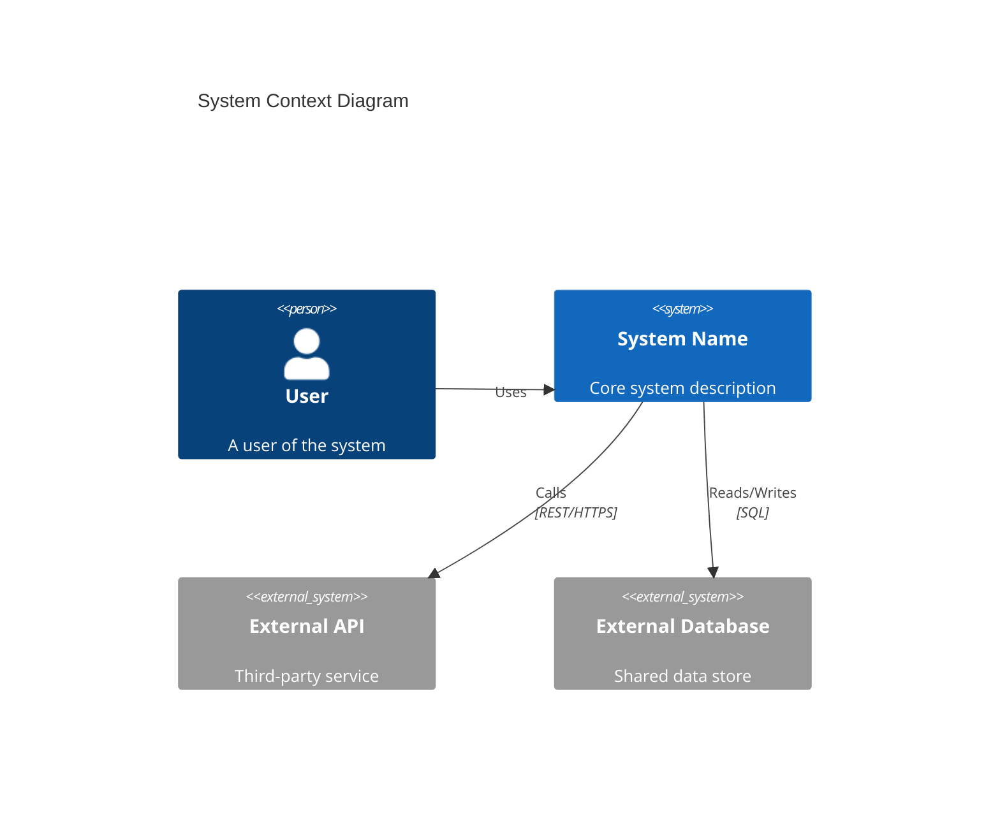
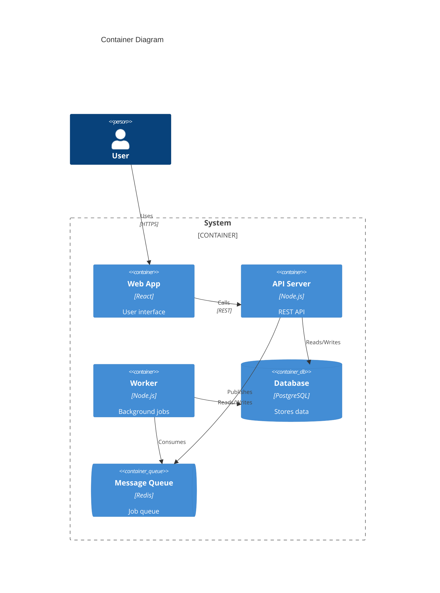
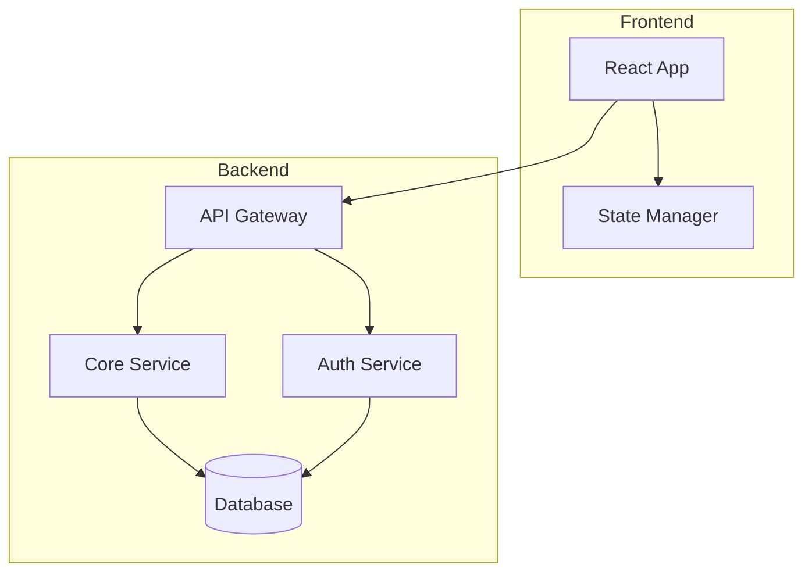
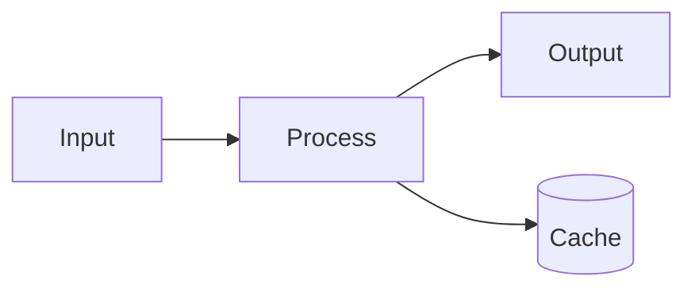
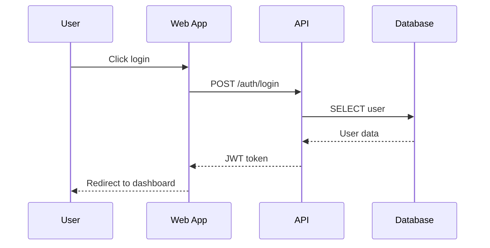
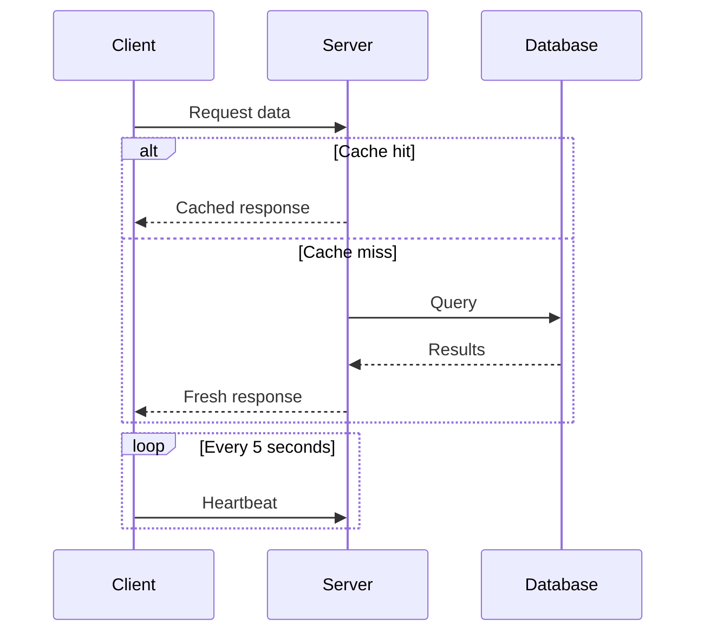
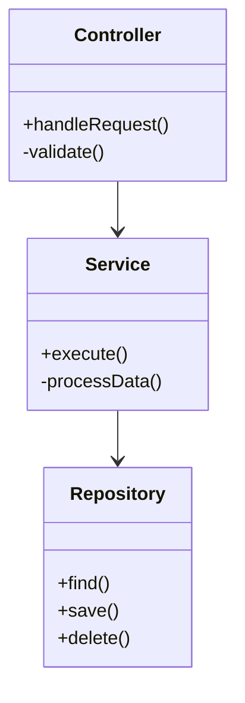
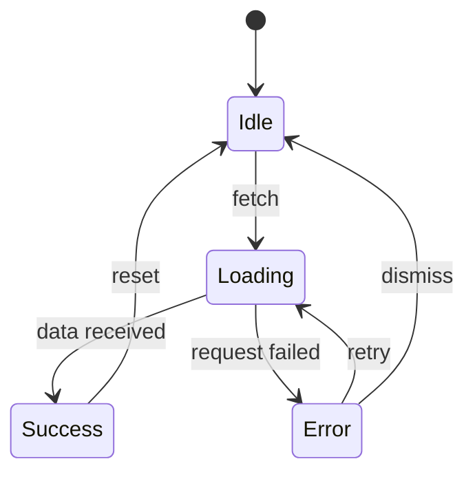
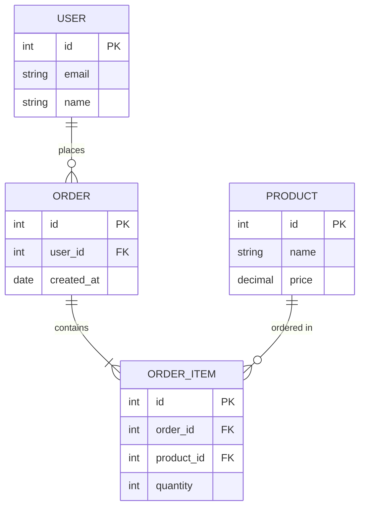

# Mermaid Diagram Types Reference

## C4 Context Diagram (Level 1 - System Overview)

Use for showing system boundaries and external actors.

## C4 Container Diagram (Level 2 - Components)

Use for showing major containers/services within the system.

## Flowchart (Components & Data Flow)

Use for showing component relationships or process flows.

### Horizontal Layout

## Sequence Diagram (Module Deep Dives)

Use for showing interaction flows between components.

### With Loops and Conditionals

## Class Diagram (Module Structure)

Use for showing class relationships and dependencies.

## State Diagram (State Management)

Use for showing state transitions.

## Entity Relationship Diagram (Data Models)

Use for showing database schema relationships.

## Choosing the Right Diagram

| Documentation Level | Primary Diagram | Alternative |
|---------------------|-----------------|-------------|
| System Overview | C4Context | Flowchart (LR) |
| Components | C4Container | Flowchart (TD) |
| Module Deep Dive | Sequence | Class, State |
| Data Flow | Flowchart | Sequence |
| Data Models | ERDiagram | Class |
